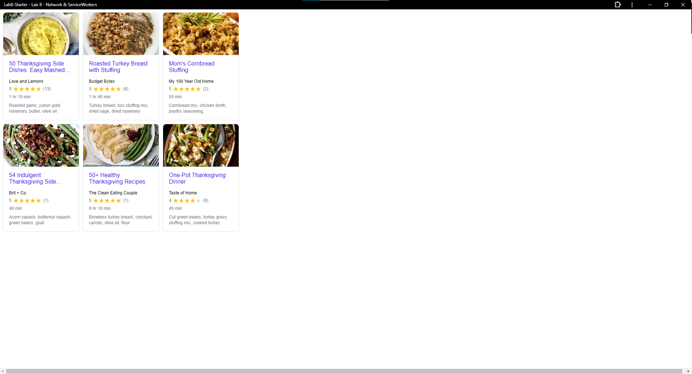

# Lab8-Starter

Teammates: Ryan and Derrick

(Link to Github pages)[]

## How are graceful degradation and service workers related

Graceful degredation is a philosophy which values building applications with advanced and robust technology that is then degraded to work on less capable environments. Service workers allow us to provide graceful degredation by keeping our apps functional even if the user loses connection or has poor internet. It also keeps performance high via caching in case of an internet outage.

